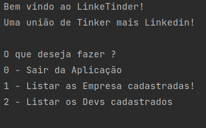

# LinkedTinder

| Dependencies | Version   |
|--------------|-----------|
| Java         | \>= 11    | 
| PostgreSQL   | \>= 14.3    | 
| Groovy       | \>= 4.0   | 
| Gradle       | \>= 5.1.1 |
| JUnit        | \>= 5.8.1 |

| Frameworks   | Version   |
|--------------|-----------|
| Angular      | Desenvolvimento do Frontend | 
| Spring       | Desenvolvimento do Backend  | 
| Spoc         | Testes Únitários  | 
| Intellij     | IDE |
| PostgreSQL   | Manutenção do Banco de Dados |
| Git          | Versionamento do código |
| GitHub       | Repositório Online      |

Angular Framework
Spring Framework
Spock(Testes Unitários)
Intellij
Git e Github

# Próximos Updates:

- Opção de desfazer alterações.
- Inserir pessoas e Empresas
- Updates no banco de dados
- Entradas Inválidas não são permitidas em toda a execução do código.

# Versão 1.0.0-alpha

**-Implementação da Aplicação.**

## Funções:

### Listar as Pessoas e Empresas:

Apenas imprime os cadastrados no banco de dados

Aqui, você receberá um output com uma listagem seccionada por cada ramo.

### Alterações de Devs e Empresa:

As alterações aqui só serão feitas alterando o arquivo file.txt.
